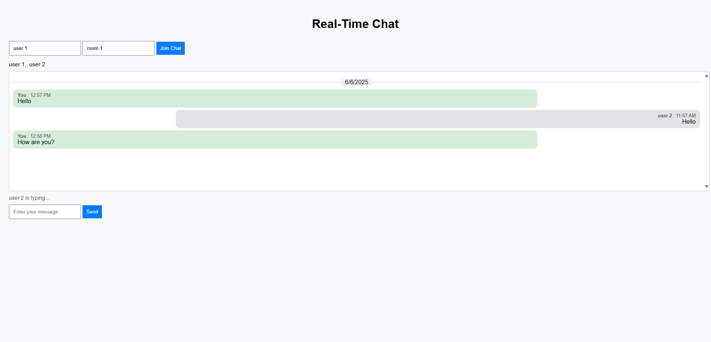

# 💬 flatfile-chat – PHP WebSocket Room Chat Without a Database

A lightweight real-time chat app with multi-room support using PHP WebSockets and flat file storage.  
Messages are stored in `.txt` files per room. No database required.



*Preview of the chat interface showing real-time messages and user list*

---

## 🚀 Features

- 🔌 WebSocket-based communication using Ratchet  
- 👥 User list per room  
- 🗨️ Real-time messaging  
- ✍️ Typing indicator  
- 📁 Chat logs saved to `.txt` files per room  
- 🖥️ Simple and clean UI using vanilla HTML/CSS/JS  

---

## 📦 Requirements

- PHP 7.4 or higher  
- Composer  
- Web browser (Chrome, Firefox, etc.)  
- XAMPP (for local hosting) ✅  

---

## 🛠 Installation & Usage

Follow these steps to run the project on your local machine using XAMPP:

---

### 📁 1. Place the Project in XAMPP

Make sure the folders like `public/`, `bin/`, `src/`, and `composer.json` are directly inside:

```
C:\xampp\htdocs\
```

---

### ⚙️ 2. Start Apache via XAMPP Control Panel

- Open **XAMPP Control Panel**  
- Click **Start** next to **Apache**

*(You don't need MySQL for this project.)*

---

### 💻 3. Install Dependencies using Composer

Open **Command Prompt (CMD)** or **Git Bash**, then run:

```bash
cd C:\xampp\htdocs
composer install
```

---

### 🔌 4. Start the WebSocket Server

In the same terminal, run:

```bash
php bin/server.php
```

If you see:

```
WebSocket server running on port 8080...
```

✅ The server is working fine.

---

### 🌐 5. Open the Chat Interface

In your browser, go to:

```
http://localhost/public/
```

- Enter your **username** and **room name**
- Start chatting in real-time!

---

## 🧑‍💻 Author

- **Ahmad Zaid**  
  📧 [ahmad.m.dsalman20@gmail.com](mailto:ahmad.m.dsalman20@gmail.com)  
  💼 [GitHub](https://github.com/ahmadzaid20) • [LinkedIn](https://linkedin.com/in/ahmad-moh-zaid)

---

## 📃 License

This project is open-source and available under the [MIT License](LICENSE).